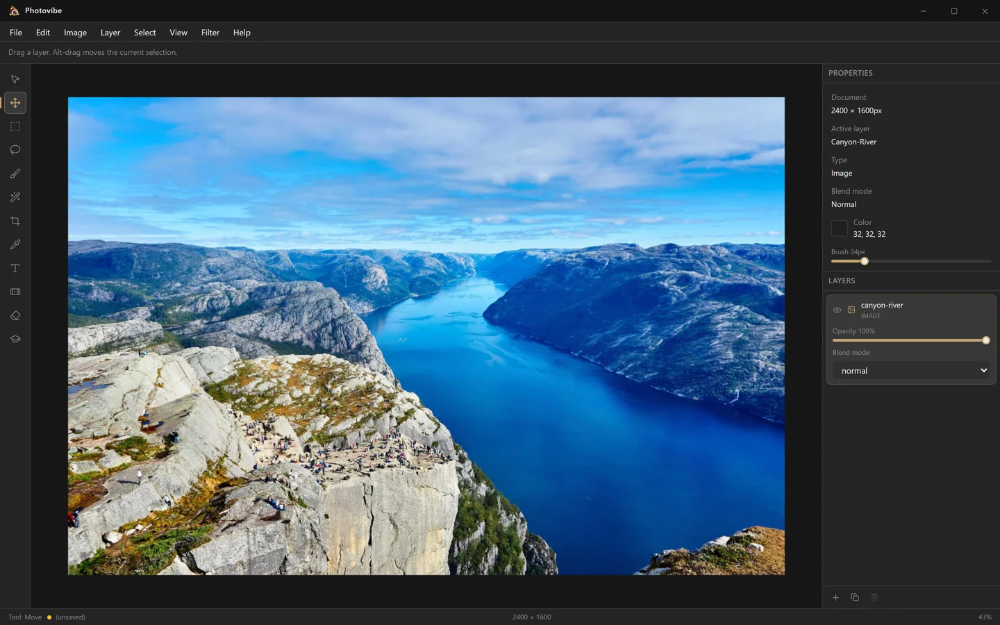

# Photovibe

A free, open-source photo editor for Windows — a local-first Photoshop alternative with
layers, blend modes and selections. No account, no cloud, no subscription.

**[photovibe.mory.dev](https://photovibe.mory.dev)** ·
[Download](https://photovibe.mory.dev/download) ·
[Documentation](https://photovibe.mory.dev/docs) ·
[Roadmap](https://photovibe.mory.dev/docs/roadmap)



Built with Tauri 2, React and a custom WebGL2 compositing engine.

## What works today

- Multi-layer documents with per-layer opacity and 13 GPU-composited blend modes
- Open PNG, JPEG and WebP; paste from the clipboard; save back to disk
- Rectangular, freehand and magic-wand selections
- Brush, eraser, gradient, healing and text tools
- Eyedropper that samples anywhere on screen
- Image resizing and cropping
- Full undo/redo history with named steps

Photovibe is early software. The
[roadmap](https://photovibe.mory.dev/docs/roadmap) lists exactly what is still missing —
layer masks, adjustment layers, export dialogs, filters and PSD support among them.

## Development

Requires [Node.js](https://nodejs.org/) 22+, [pnpm](https://pnpm.io/) 10 and
[Rust](https://rustup.rs/).

```bash
pnpm install
pnpm tauri dev
```

| Command | Description |
|---|---|
| `pnpm tauri dev` | Run the desktop app in dev mode |
| `pnpm dev` | Run only the frontend at `localhost:1420` |
| `pnpm build` | Type-check and build the frontend |
| `pnpm test` | Run unit tests |
| `pnpm tauri build` | Build a production desktop app |

Full setup notes are in
[Building from source](https://photovibe.mory.dev/docs/build-from-source).

## Releases

Tagging `v*` runs [`.github/workflows/release.yml`](.github/workflows/release.yml), which
builds the NSIS installer, signs it with a public-trust Authenticode certificate through
Azure Trusted Signing (authenticated by GitHub OIDC — no long-lived credential lives in
this repository), and publishes it with a `SHA256SUMS` file. See
[Azure artifact signing](docs/azure-artifact-signing.md) and
[Installing and verifying](https://photovibe.mory.dev/docs/install-and-verify).

## Website

The site at [photovibe.mory.dev](https://photovibe.mory.dev) lives in [`site/`](site) and is
deployed by Vercel. Its screenshots are captured from the running editor rather than mocked
up — see [docs/website.md](docs/website.md).

## Contributing

Issues and pull requests are welcome — see [CONTRIBUTING.md](CONTRIBUTING.md).

## License

MIT — see [LICENSE](LICENSE).
